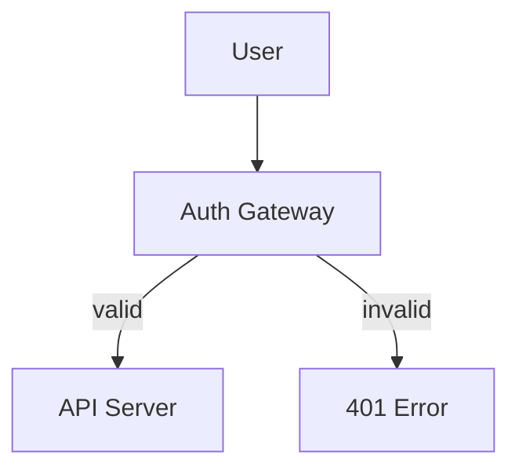

# Mermaid Diagram Generator — CoCo Plugin

A Cortex Code plugin that converts natural language descriptions into Mermaid diagrams using a three-agent pipeline: Analyst → Builder → Validator. The Validator checks the output against your original requirements and automatically retries up to 3 times, making it significantly more accurate than single-shot generation.

Diagrams render directly in `.md` files and CoCo presentations — no extra tooling needed.

## Supported Diagram Types

| Type | Mermaid keyword | Best for |
|---|---|---|
| Flowchart | `flowchart TD / LR` | Business processes, decision trees, code flow |
| Sequence | `sequenceDiagram` | API interactions, auth flows, event handling |
| Architecture | `architecture-beta` | Cloud infra, Snowflake platform diagrams |
| ER Diagram | `erDiagram` | Database schemas, data models |
| Class Diagram | `classDiagram` | OOP models, domain entities |

## How to Install

### Option 1 — Natural language (easiest)

Paste this into a Cortex Code chat:

```
I want to install this local plugin: /path/to/mermaid-diagram
```

Or if hosted on GitHub:

```
I want to import this as a remote skill from github https://github.com/sfpscogs-rnellikal/mermaid-diagram.git
```

### Option 2 — Via skill command

```
$github-plugin-installer https://github.com/sfpscogs-rnellikal/mermaid-diagram
```

## Usage

Once installed, the skill activates automatically when you describe a diagram. You can also invoke it explicitly:

```
$mermaid-diagram draw a user authentication flow with OAuth2 token exchange
```

```
$mermaid-diagram create an ER diagram for an e-commerce database with orders, customers, and products
```

```
$mermaid-diagram architecture of a Kafka to Snowflake streaming pipeline
```

## How It Works

1. **Analyst** parses your prompt and extracts components, relationships, and diagram type into a structured brief.
2. **Builder** converts the brief into valid Mermaid syntax using the relevant syntax reference.
3. **Validator** compares the output against your original requirements and returns PASS or FAIL with specific issues.
4. If the Validator fails, the Builder retries with the specific correction list (up to 3 iterations).

## Output

The skill outputs a fenced Mermaid code block that renders directly in any `.md` file:

````markdown

````

## Contributing

Built by Ratheesh Nellikal. Submit issues or improvements via PR.
