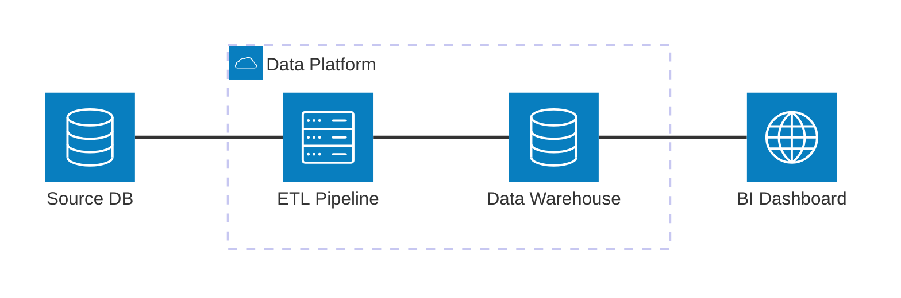
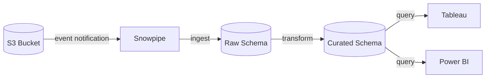

# Architecture Diagram Syntax Reference

Mermaid's `architecture-beta` keyword (Mermaid v11+) is designed for infrastructure and system architecture diagrams. It supports services, groups (bounding boxes), icons, and directional edges.

## Skeleton



## Service Declaration

```
service id(icon)[Display Label]
service id(icon)[Display Label] in groupId
```

- `id` — camelCase identifier, no spaces
- `icon` — one of: `server`, `database`, `cloud`, `internet`, `disk`, `edge`, `lambda`
- `Display Label` — human-readable text shown in the diagram
- `in groupId` — places the service inside a named group (optional)

## Group Declaration

```
group id(icon)[Display Label]
```

Groups create a bounding box. Services inside them use `in groupId`.

## Edge Syntax

```
serviceA:R -- L:serviceB
```

Format: `sourceId:exitPort -- entryPort:targetId`

Port positions:
| Symbol | Position |
|---|---|
| `T` | Top |
| `B` | Bottom |
| `L` | Left |
| `R` | Right |

Common patterns:
- Left-to-right pipeline: `A:R -- L:B` (A's right connects to B's left)
- Top-to-bottom hierarchy: `A:B -- T:B` (A's bottom connects to B's top)

**Note:** `architecture-beta` does not support edge labels. The connection type should be conveyed through node labels or the diagram context.

## Icon Reference

| Icon name | Represents |
|---|---|
| `server` | Application server, compute, API |
| `database` | Database, data store, table |
| `cloud` | Cloud provider, external service |
| `internet` | Web, browser, end-user interface |
| `disk` | Storage, file system, S3 |
| `edge` | Edge location, CDN node |
| `lambda` | Function, serverless |

## When to Use architecture-beta vs flowchart LR

Use `architecture-beta` when:
- The diagram is showing infrastructure components (cloud services, servers, databases)
- You want the icon-based visual style
- Message ordering is not important (it's a topology, not a sequence)

Use `flowchart LR` when:
- You need edge labels showing data flow or transformation names
- The diagram has decision logic
- Mermaid version compatibility is uncertain (architecture-beta is v11+ only)

A flowchart LR can represent the same topology with labeled edges:



## Full Working Example: Snowflake Data Platform

```mermaid
architecture-beta
    group awsGroup(cloud)[AWS]
    group snowflakeGroup(cloud)[Snowflake]

    service s3(disk)[S3 Bucket] in awsGroup
    service snowpipe(server)[Snowpipe] in snowflakeGroup
    service rawDb(database)[Raw Database] in snowflakeGroup
    service dynamicTables(server)[Dynamic Tables] in snowflakeGroup
    service curatedDb(database)[Curated Database] in snowflakeGroup
    service cortex(lambda)[Cortex AI] in snowflakeGroup
    service tableau(internet)[Tableau]
    service powerbi(internet)[Power BI]

    s3:R -- L:snowpipe
    snowpipe:R -- L:rawDb
    rawDb:R -- L:dynamicTables
    dynamicTables:R -- L:curatedDb
    curatedDb:R -- L:cortex
    curatedDb:B -- T:tableau
    curatedDb:B -- T:powerbi
```



## Common Gotchas

| Problem | Cause | Fix |
|---|---|---|
| Services not appearing | Missing `service` keyword | Use `service id(icon)[Label]` — not just `id[Label]` |
| Groups not showing | Service `in groupId` references wrong ID | Check the group ID matches exactly (case-sensitive) |
| Edge not rendering | Port direction wrong | Use `A:R -- L:B` for left-to-right, not `A --> B` |
| Icon not showing | Unsupported icon name | Use only: `server`, `database`, `cloud`, `internet`, `disk`, `edge`, `lambda` |
| Renderer shows "beta" notice | Expected — `architecture-beta` is in preview | Normal behavior, diagram still renders |
