# Common Mermaid Patterns

Patterns that apply across multiple diagram types: subgraph grouping, notes, icons, click events, and cross-type tips.

## Universal Syntax Rules (All Types)

These rules apply to every diagram type:

1. **No spaces in node/participant IDs** — IDs must be single tokens
2. **Never use reserved keywords as IDs** — `end`, `subgraph`, `graph`, `flowchart`, `direction`
3. **Use ` ` for multi-line labels, never `\n`** — `\n` renders as literal text in SVG; ` ` renders as a real line break. Other HTML tags (`<b>`, `<i>`) still render as literal text — avoid them.
4. **Use the Snowflake brand palette via `classDef`** — assign major node groups with shared `classDef` and `class` rules. Up to five slots, each a pale tint over the full-strength brand stroke: `#D6EFFA/#11567F` Mid-Blue for sources and providers, `#E9F7FD/#29B5E8` Snowflake Blue for the core platform, `#EDE7F5/#7254A3` Purple Moon for replication and transport, `#E4F6F8/#75CDD7` Star Blue for the consumer side, `#FFF1E0/#FF9F36` Valencia Orange for downstream outputs. All classes use `stroke-width:2px,color:#000000`. Snowflake Blue and Mid-Blue carry the diagram; the other three are accents used sparingly. Give subgraphs `fill:#F5FBFE` with a `color:#11567F` title.
5. **Quote edge labels with special characters** — parentheses, slashes, colons, commas

## Subgraph / Grouping Patterns

### Flowchart Subgraph

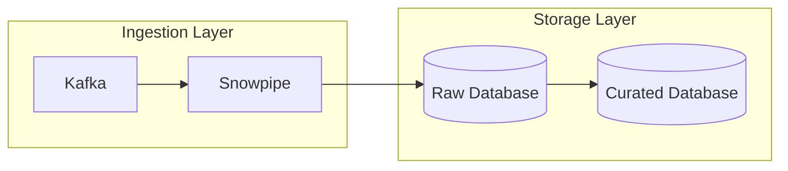

### Stacked Stages — hub and companion (preferred for pipelines)

For a multi-stage pipeline, give each group one **hub** node carrying both the
inbound and outbound edge, listed first, with **no internal edge** to its
companion. All hubs land in one column, producing a straight vertical spine with
every group left-aligned.

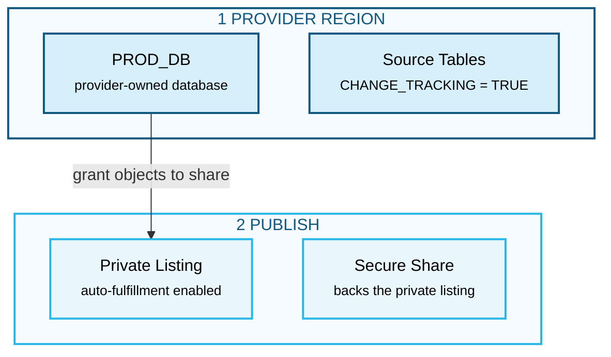

Adding `ProdDb --> SourceTbl` here would stack that pair into two rows and break
the spine. Note also that the subtitle lengths are within a few characters of one
another — that is what keeps the box edges aligned.

### Nested Subgraphs

Subgraphs can be nested inside other subgraphs:

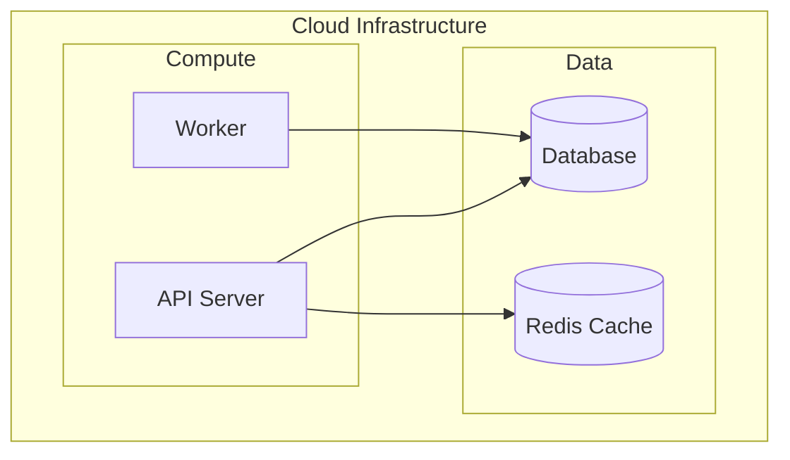

### Cross-Subgraph Edges

Edges can freely cross subgraph boundaries — just reference the node IDs:

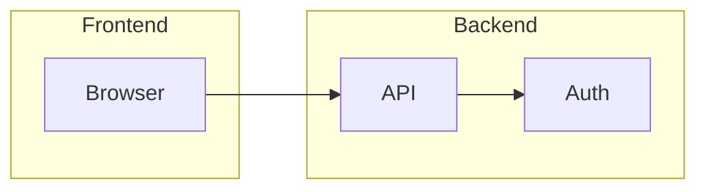

## Note / Annotation Patterns

### Sequence Diagram Notes

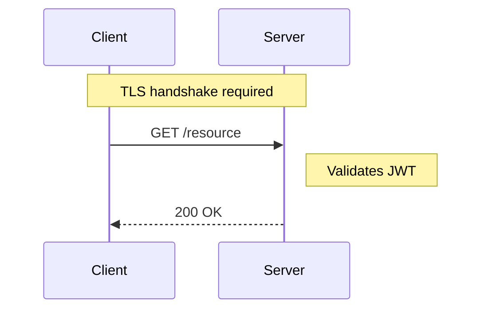

### Flowchart Comment Notes

Mermaid flowcharts don't have a native note block, but you can use a descriptive rectangle node and a dashed edge to convey annotation. Assign it with the same palette-based `classDef` approach as the rest of the diagram:

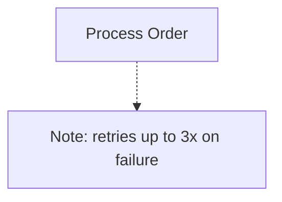

## Aliases and Display Names

### Flowchart (label in node definition)

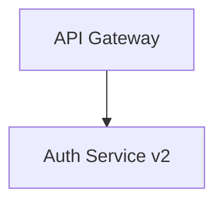

### Sequence Diagram (participant alias)

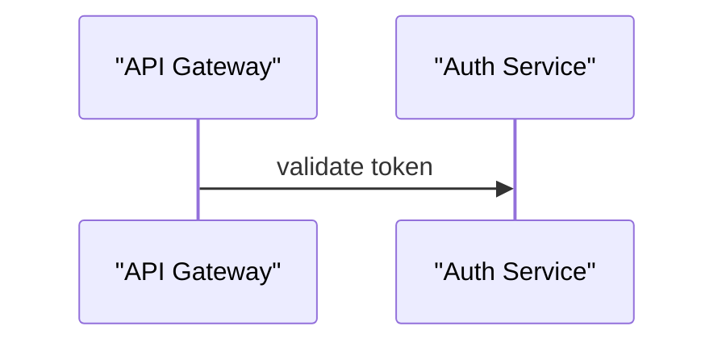

## Long Labels — Keeping Them Readable

Long labels in nodes should be kept under ~30 characters. For longer text, abbreviate or split responsibility between the node and the edge label:

- Instead of: `ProcessPaymentAndUpdateInventory["Process Payment and Update Inventory"]`
- Use: `OrderFulfillment["Order Fulfillment"]` with an edge label that provides the detail

## Pipeline / Data Flow Pattern (flowchart LR)

The most readable pattern for ETL/ELT pipelines:

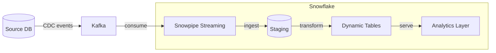

## Parallel Paths Pattern

Show parallel execution in flowchart:

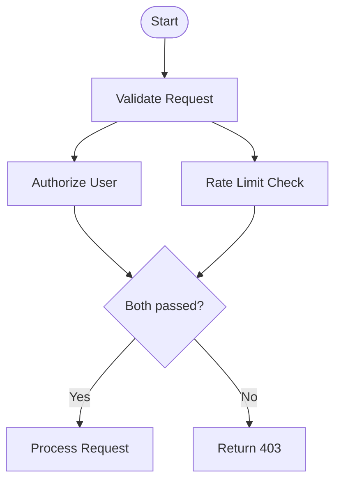

## Retry Loop Pattern

Show a retry loop with a counter or max attempts:

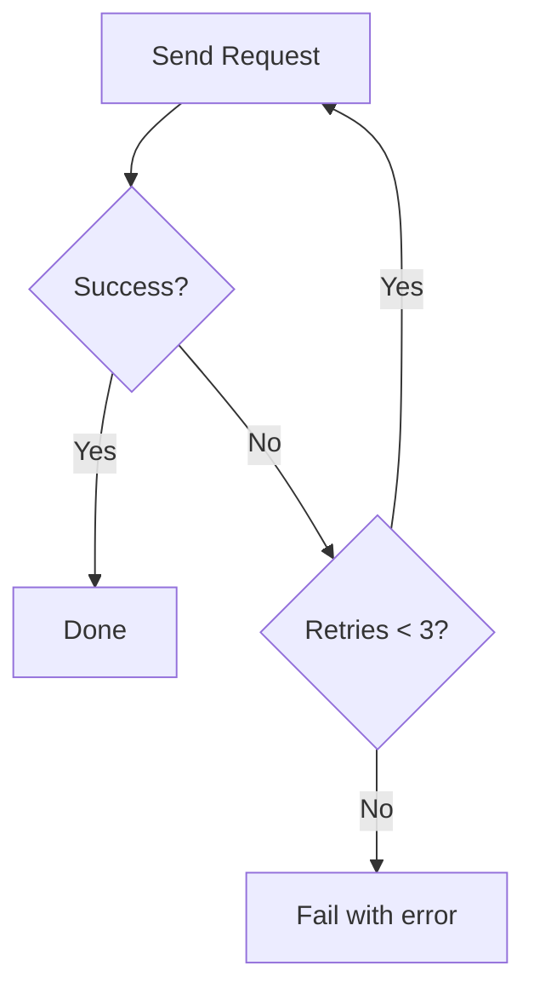

## Mermaid Version Compatibility Notes

| Feature | Min version |
|---|---|
| `flowchart` keyword | v8+ |
| `sequenceDiagram` | v8+ |
| `erDiagram` | v8+ |
| `classDiagram` | v8+ |
| `architecture-beta` | v11+ |

CoCo's markdown preview and GitHub both support Mermaid v10+. Use `architecture-beta` only when you're confident the rendering environment supports v11. When in doubt, use `flowchart LR` with cylinder nodes `[("Database")]` for infrastructure diagrams — it's compatible everywhere.
