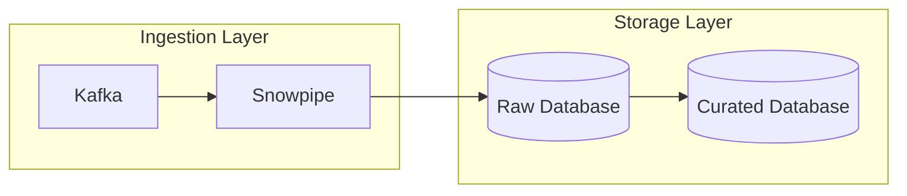
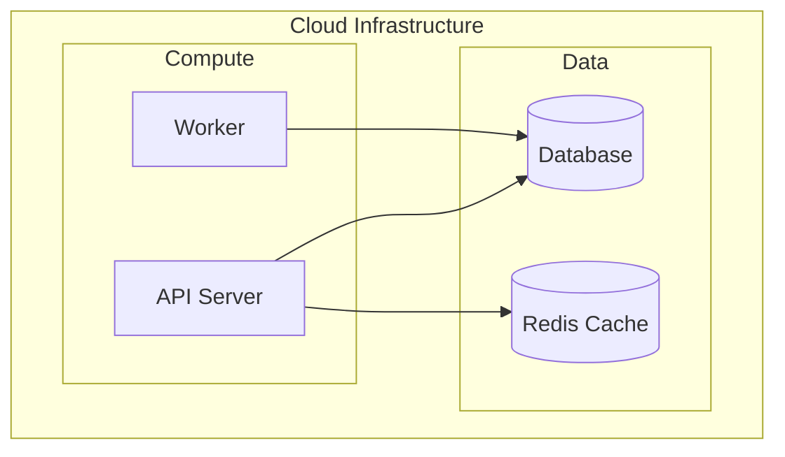
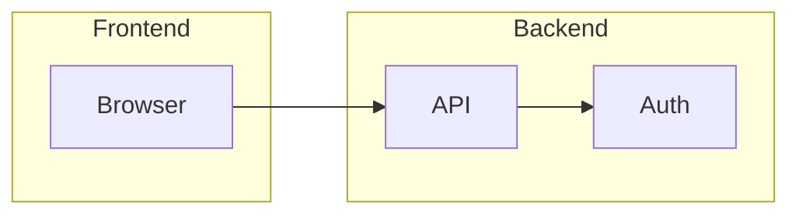
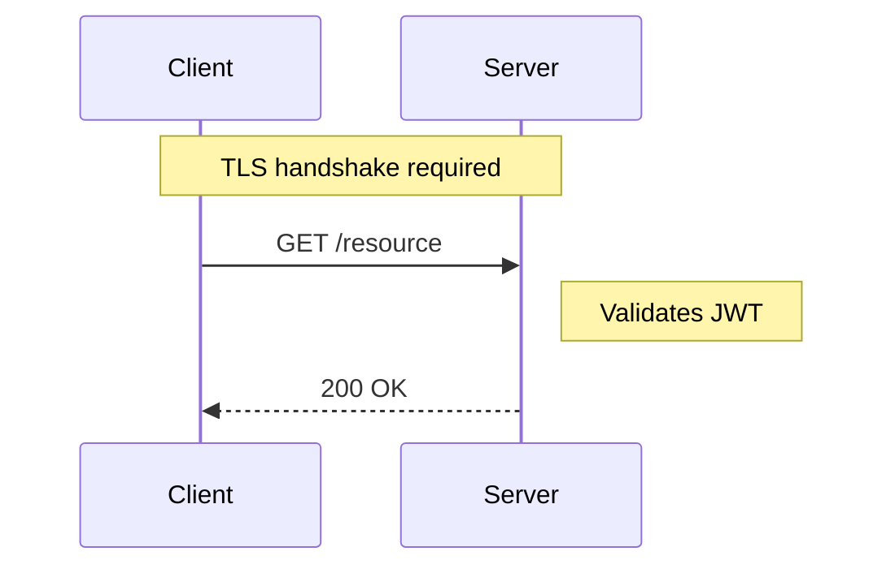
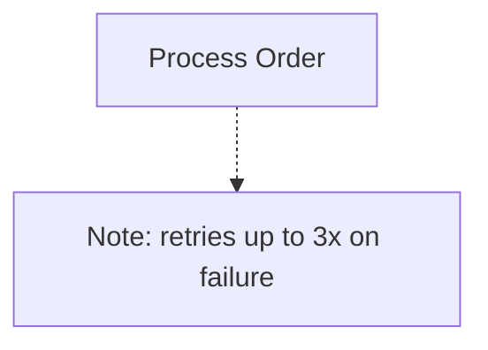
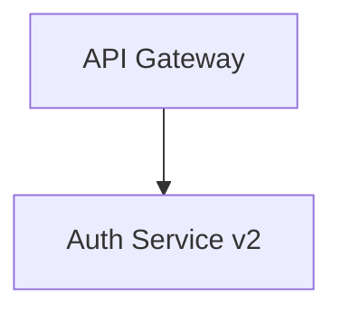
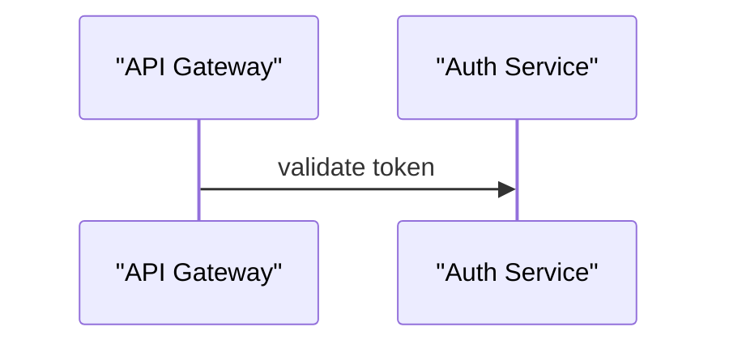
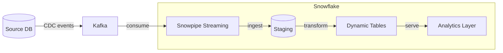
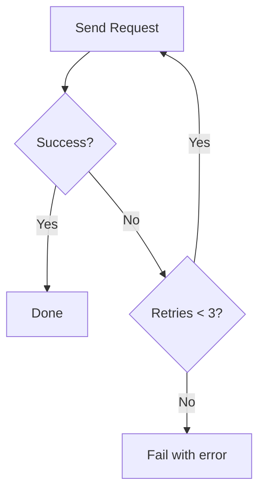

# Common Mermaid Patterns

Patterns that apply across multiple diagram types: subgraph grouping, notes, icons, click events, and cross-type tips.

## Universal Syntax Rules (All Types)

These rules apply to every diagram type:

1. **No spaces in node/participant IDs** — IDs must be single tokens
2. **Never use reserved keywords as IDs** — `end`, `subgraph`, `graph`, `flowchart`, `direction`
3. **No HTML tags in labels** — ` `, `<b>`, `<i>` render as literal text
4. **No explicit colors or styles** — `style`, `classDef fill:`, `:::className` break in dark mode
5. **Quote edge labels with special characters** — parentheses, slashes, colons, commas

## Subgraph / Grouping Patterns

### Flowchart Subgraph

### Nested Subgraphs

Subgraphs can be nested inside other subgraphs:

### Cross-Subgraph Edges

Edges can freely cross subgraph boundaries — just reference the node IDs:

## Note / Annotation Patterns

### Sequence Diagram Notes

### Flowchart Comment Notes

Mermaid flowcharts don't have a native note block, but you can use a styled node as a visual note. Since explicit styles break dark mode, use a descriptive label with a rectangle node and a dashed edge to convey annotation:

## Aliases and Display Names

### Flowchart (label in node definition)

### Sequence Diagram (participant alias)

## Long Labels — Keeping Them Readable

Long labels in nodes should be kept under ~30 characters. For longer text, abbreviate or split responsibility between the node and the edge label:

- Instead of: `ProcessPaymentAndUpdateInventory["Process Payment and Update Inventory"]`
- Use: `OrderFulfillment["Order Fulfillment"]` with an edge label that provides the detail

## Pipeline / Data Flow Pattern (flowchart LR)

The most readable pattern for ETL/ELT pipelines:

## Parallel Paths Pattern

Show parallel execution in flowchart:

## Retry Loop Pattern

Show a retry loop with a counter or max attempts:

## Mermaid Version Compatibility Notes

| Feature | Min version |
|---|---|
| `flowchart` keyword | v8+ |
| `sequenceDiagram` | v8+ |
| `erDiagram` | v8+ |
| `classDiagram` | v8+ |
| `architecture-beta` | v11+ |

CoCo's markdown preview and GitHub both support Mermaid v10+. Use `architecture-beta` only when you're confident the rendering environment supports v11. When in doubt, use `flowchart LR` with cylinder nodes `[("Database")]` for infrastructure diagrams — it's compatible everywhere.
