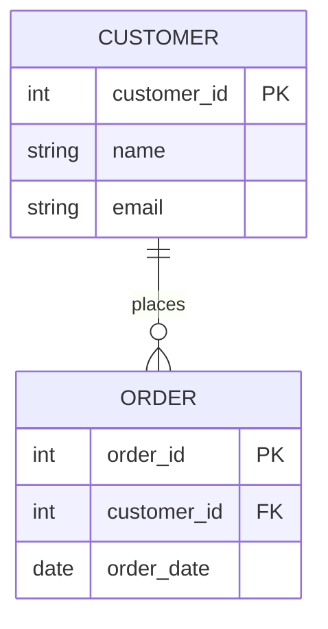
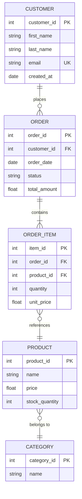
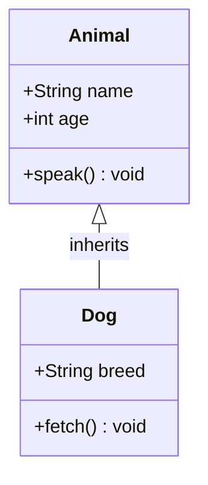
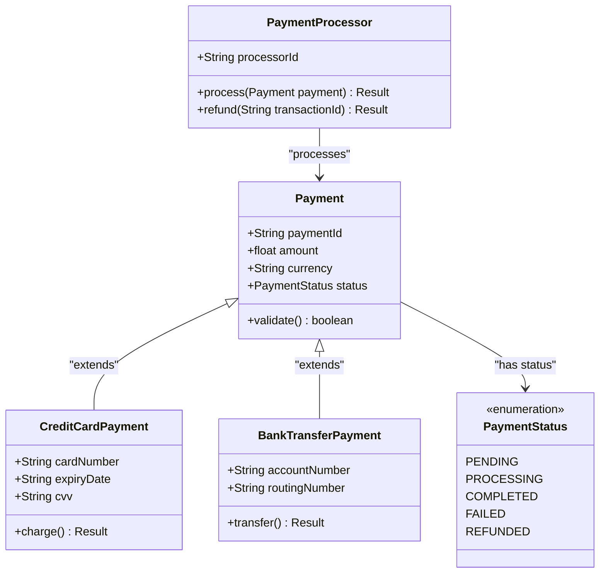

# ER Diagram and Class Diagram Syntax Reference

## Part 1: ER Diagrams

`erDiagram` represents database entities, their attributes, and relationships with cardinality notation.

### Skeleton



### Entity and Attribute Syntax

```
ENTITY_NAME {
    type field_name constraint
}
```

- Entity names: use UPPER_CASE (convention)
- Field types: `int`, `string`, `date`, `datetime`, `float`, `boolean`, `varchar`
- Constraints: `PK` (primary key), `FK` (foreign key), `UK` (unique key) — or omit for regular fields

### Relationship Syntax

```
ENTITY_A cardinality-left--cardinality-right ENTITY_B : "label"
```

Cardinality symbols:
| Symbol | Meaning |
|---|---|
| `\|\|` | Exactly one |
| `o\|` | Zero or one |
| `\}o` | Zero or more (crow's foot) |
| `\}\|` | One or more (crow's foot) |

Common relationship patterns:
```
CUSTOMER ||--o{ ORDER : "places"          -- one customer places zero or more orders
ORDER }o--|| PRODUCT : "contains"         -- zero or more orders contain exactly one product
EMPLOYEE o|--o| DEPARTMENT : "belongs to" -- optional employee belongs to optional department
```

The label in quotes describes the relationship verb.

### Full Working Example: E-Commerce Schema



### Common Gotchas (ER)

| Problem | Cause | Fix |
|---|---|---|
| Cardinality symbols not rendering | Unescaped pipe character in markdown | Use the correct Mermaid symbols inside a fenced block |
| Relationship label not showing | Missing quotes | Wrap label in double quotes: `"places"` |
| Attribute not displaying | Wrong syntax | Format is `type name constraint` — all on one line |

---

## Part 2: Class Diagrams

`classDiagram` represents object-oriented class structures with attributes, methods, and relationships.

### Skeleton



### Visibility Modifiers

| Symbol | Meaning |
|---|---|
| `+` | Public |
| `-` | Private |
| `#` | Protected |
| `~` | Package/internal |

### Member Syntax

```
+Type fieldName
+methodName(paramType) returnType
```

Examples:
```
+String customerName
-int accountBalance
#validateToken(String token) boolean
+processOrder(Order order) void
```

### Relationship Types

| Syntax | Relationship | Meaning |
|---|---|---|
| `A <\|-- B` | Inheritance | B inherits from A |
| `A *-- B` | Composition | A is composed of B (B can't exist without A) |
| `A o-- B` | Aggregation | A has B (B can exist independently) |
| `A --> B` | Association | A uses/references B |
| `A -- B` | Link | Generic association, no direction |
| `A ..> B` | Dependency | A depends on B |
| `A ..\|> B` | Realization | A implements interface B |

Add a label after the relationship: `A <|-- B : "extends"`

### Cardinality on Class Diagrams

```
Customer "1" --> "0..*" Order : places
```

Cardinality strings go between quotes on each side of the relationship arrow.

### Full Working Example: Payment Domain



### Annotations (Stereotypes)

```
class MyInterface {
    <<interface>>
    +method() void
}
class MyEnum {
    <<enumeration>>
    VALUE_ONE
    VALUE_TWO
}
class AbstractBase {
    <<abstract>>
    +abstractMethod() void
}
```

### Common Gotchas (Class)

| Problem | Cause | Fix |
|---|---|---|
| Relationship arrow not rendering | Wrong arrow syntax | Use exactly `<\|--` for inheritance, `*--` for composition |
| Method missing return type | Incomplete syntax | `+method() void` or `+method() ReturnType` |
| Annotation not showing | Missing double angle brackets | Use `<<interface>>` not `<interface>` |
