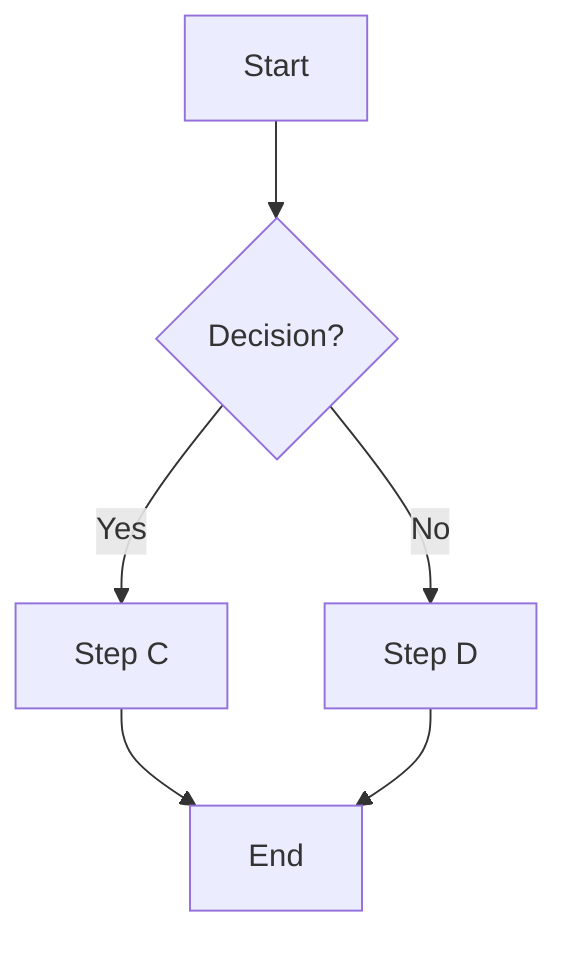
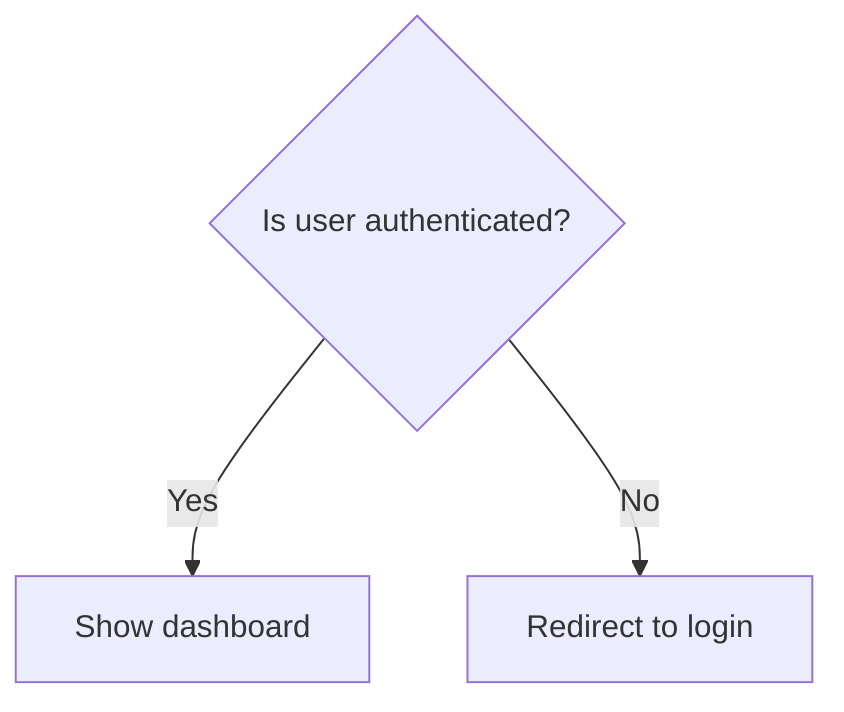
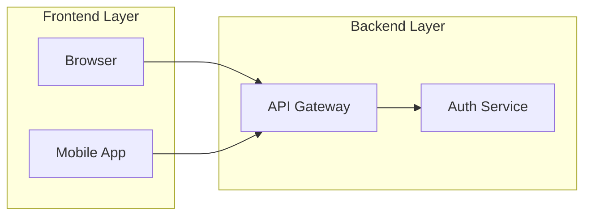
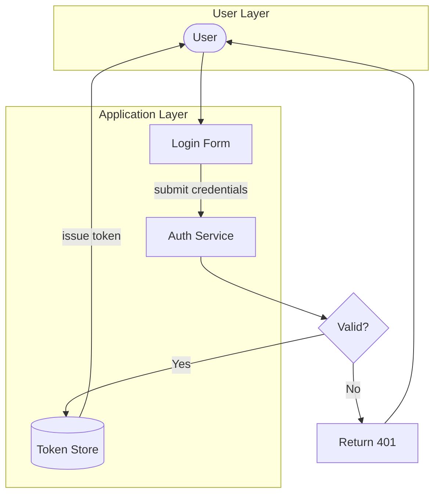

# Flowchart Syntax Reference

Mermaid flowcharts use the `flowchart` keyword. They support directed graphs with nodes, edges, decision branches, and subgraphs.

## Skeleton

## Direction

| Keyword | Meaning |
|---|---|
| `TD` | Top-down (default for hierarchies and process flows) |
| `LR` | Left-to-right (preferred for pipelines and data flows) |
| `BT` | Bottom-to-top |
| `RL` | Right-to-left |

Declare on the first line: `flowchart LR`

## Node Shapes

| Syntax | Shape | Use for |
|---|---|---|
| `A["text"]` | Rectangle | Generic step, service, component |
| `A("text")` | Rounded rectangle | Start/end, softer step |
| `A{"text"}` | Diamond | Decision / conditional |
| `A[("text")]` | Cylinder | Database, data store |
| `A(["text"])` | Stadium | Terminal, special action |
| `A[/"text"/]` | Parallelogram | Input/output |
| `A(("text"))` | Circle | Junction, connector |

Always quote labels that contain spaces or special characters.

## Edge Types

| Syntax | Appearance | Use for |
|---|---|---|
| `A --> B` | Solid arrow | Default connection |
| `A --- B` | Solid line, no arrow | Association |
| `A -.-> B` | Dashed arrow | Optional or async path |
| `A ==> B` | Thick arrow | Primary/critical path |
| `A -->|"label"| B` | Arrow with label | Named connection |
| `A -- "label" --> B` | Arrow with label (alt syntax) | Named connection |

Edge labels with slashes, parentheses, or colons must use the quoted form: `-->|"POST /v1/token"|`

## Decision Branches

The diamond shape `{}` is the conventional decision node. Branch labels go on the edges.

## Subgraphs (Grouping)

Rules:
- `subgraph id [Human Label]` — the ID must come before the bracket
- The closing `end` keyword is required
- Nodes inside a subgraph are declared inside it, not outside

## Common Gotchas

| Problem | Cause | Fix |
|---|---|---|
| Node renders as box with weird text | ID contains a space | Use camelCase ID: `AuthService`, not `Auth Service` |
| `end` shown as a node label | Used `end` as a node ID | Rename: `endNode[End]`, `processEnd[End]` |
| Edge label disappears or breaks | Label contains `(`, `)`, `/`, `:` without quotes | Wrap in quotes: `-->|"POST /login"|` |
| Subgraph not rendering | Missing ID before label | `subgraph authGroup [Auth Layer]` not `subgraph Auth Layer` |
| Colors not showing | Applied `style fill:#hex` | Remove — colors break in dark mode |

## Full Working Example

