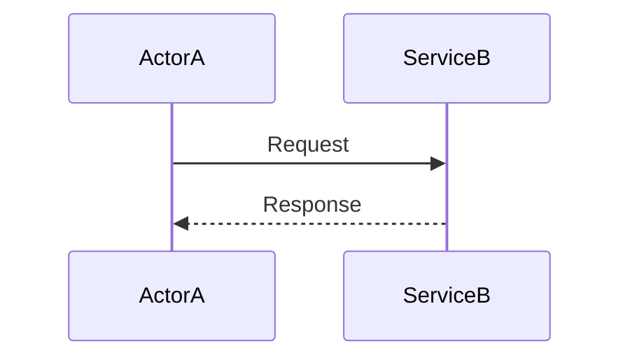
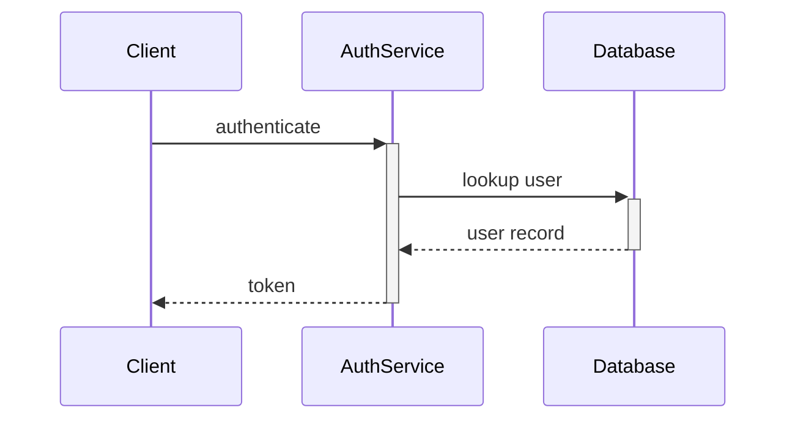
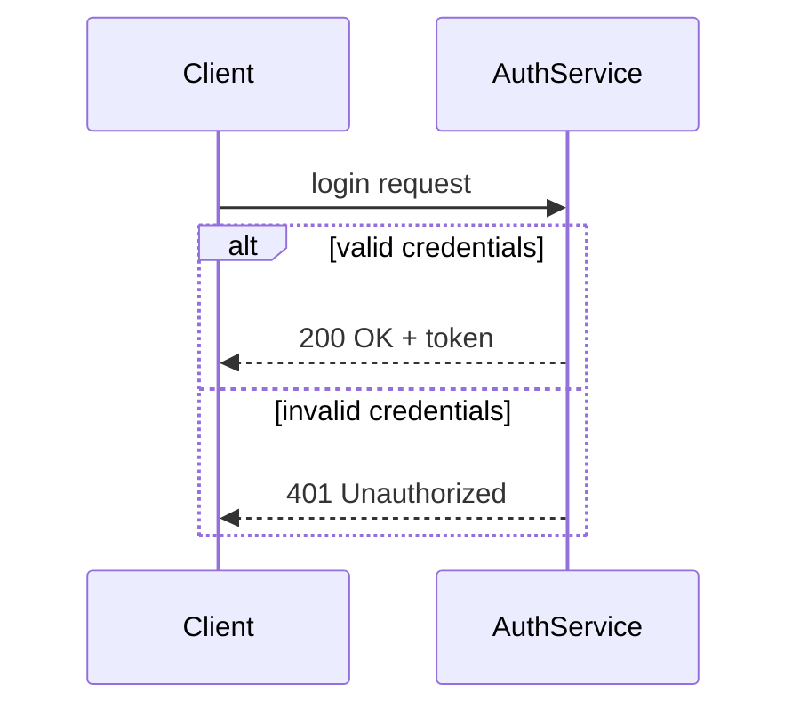
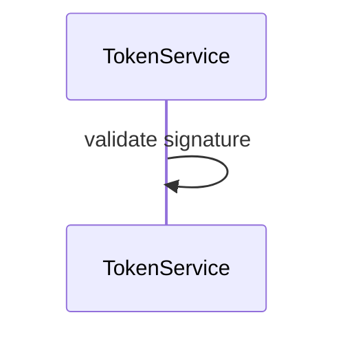
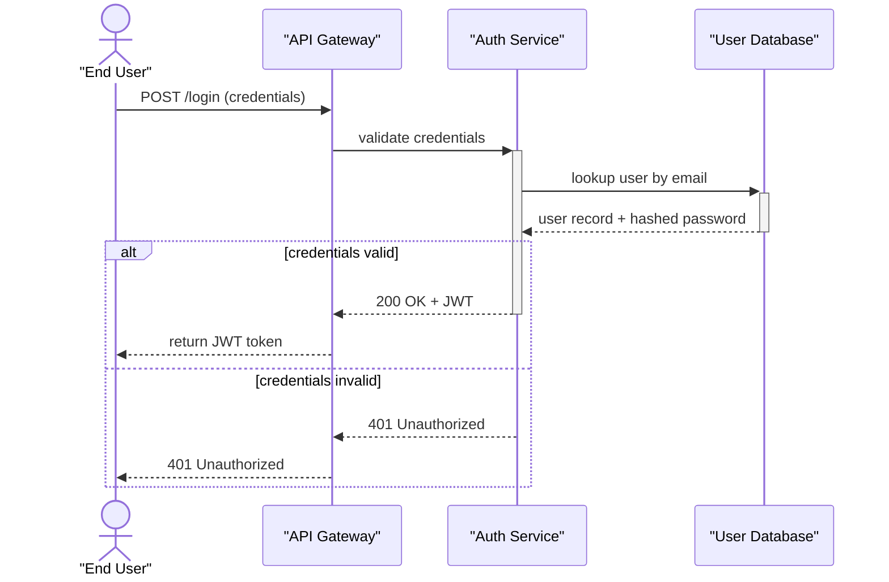

# Sequence Diagram Syntax Reference

Mermaid sequence diagrams use the `sequenceDiagram` keyword. They show the order of messages between participants over time, from top to bottom.

## Skeleton



## Participant Declaration

Declare participants at the top to control order and display names:

```
participant shortId as "Human Readable Name"
```

- Short IDs are used in edge syntax (no spaces)
- Display names appear in the rendered diagram header

If you don't declare a participant, it auto-appears when first used — but declaration is preferred for control of ordering and naming.

Actor vs participant:
```
actor User as "End User"        # shows stick figure icon
participant API as "API Server"  # shows rectangle
```

## Message Arrow Types

| Syntax | Appearance | Use for |
|---|---|---|
| `A->>B: message` | Solid, filled arrowhead | Synchronous call, request |
| `A-->>B: message` | Dashed, filled arrowhead | Response, async reply |
| `A->B: message` | Solid, open arrowhead | Fire-and-forget |
| `A-->B: message` | Dashed, open arrowhead | Optional/async notification |
| `A-xB: message` | Solid with X | Rejected/failed message |
| `A--xB: message` | Dashed with X | Failed async |

## Activation Bars

Show when a service is "active" processing a request:



`+` activates, `-` deactivates. The activation bar appears on the participant's lifeline.

## Conditional Blocks



| Block | Syntax |
|---|---|
| If/else | `alt ... else ... end` |
| Optional | `opt description ... end` |
| Loop | `loop N times ... end` |
| Parallel | `par ... and ... end` |
| Critical section | `critical ... option ... end` |

## Notes

Add annotations to a participant:
```
Note over AuthService: Validates JWT signature
Note right of Client: Stores token in localStorage
Note left of Database: Indexed on user_id
```

`Note over A,B` spans two participants.

## Self-Message (Internal Processing)



A self-loop arrow shows an internal operation.

## Common Gotchas

| Problem | Cause | Fix |
|---|---|---|
| Participant order is wrong | Auto-registration order | Declare all participants explicitly at the top |
| Message with colon in text breaks | Unescaped colon in message | Colon after the last `:` is fine; extra colons need quoting or rephrasing |
| `alt`/`loop`/`end` blocks not rendering | Missing `end` keyword | Every `alt`, `opt`, `loop`, `par` block needs a closing `end` |
| Activation bar not closing | Extra `+` without matching `-` | Every `+` needs a `-` on the return message |

## Full Working Example


