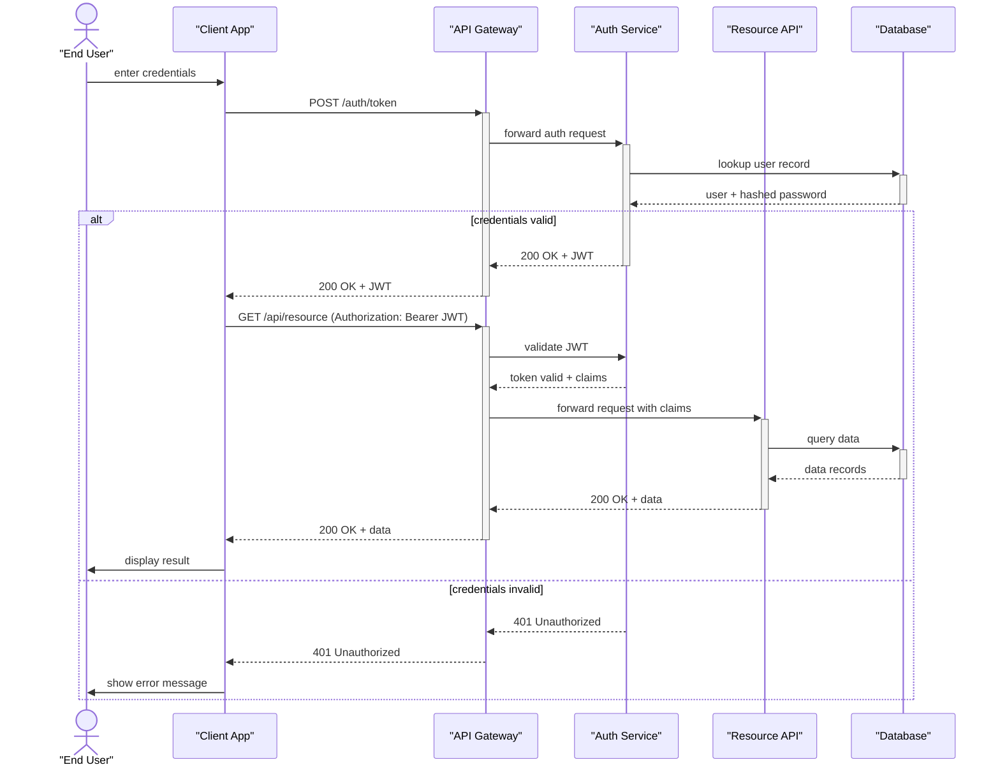
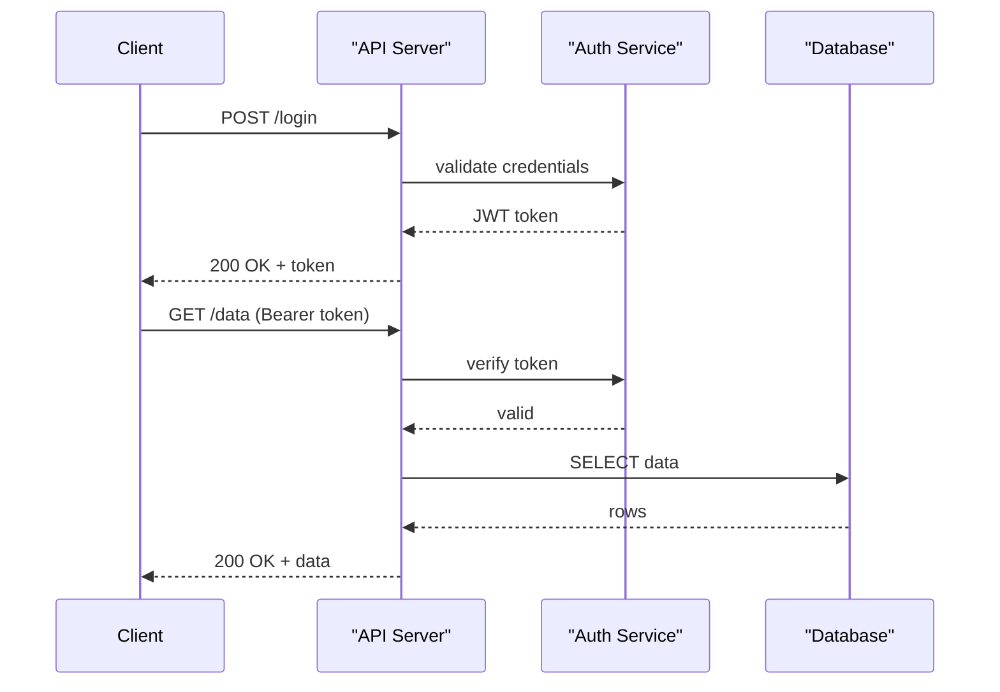

# Template: API Sequence Flow

A sequence diagram showing a client authenticating via OAuth2, then making an authorized API call.

## When to use

Use this template when the user describes an API authentication flow, a token exchange, an OAuth or JWT flow, or any request/response sequence between a client and backend services.

## Template: OAuth2 Token Exchange

## Simplified variant: request/response only

## Key customization points

- Add `loop` blocks for retry logic: `loop up to 3 retries ... end`
- Add `opt` block for refresh token: `opt token expired ... end`
- Add rate limiting: `Gateway->>RateLimiter: check rate` before forwarding
- For microservices, expand `Resource API` into multiple downstream services
