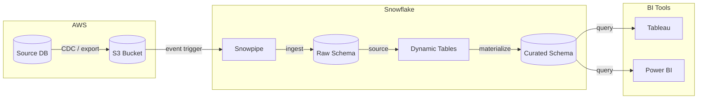

# Template: Snowflake Cloud Architecture

A left-to-right data platform architecture showing data flowing from source systems into Snowflake and out to BI tools.

## When to use

Use this template as a starting point when the user describes a cloud data platform, a Snowflake data architecture, or a data ingestion pipeline involving cloud storage and BI.

## Template

```mermaid
architecture-beta
    group awsGroup(cloud)[AWS]
    group snowflakeGroup(cloud)[Snowflake]

    service sourceDB(database)[Source Database] in awsGroup
    service s3(disk)[S3 Bucket] in awsGroup
    service snowpipe(server)[Snowpipe] in snowflakeGroup
    service rawDB(database)[Raw Schema] in snowflakeGroup
    service transforms(server)[Dynamic Tables] in snowflakeGroup
    service curatedDB(database)[Curated Schema] in snowflakeGroup
    service cortex(lambda)[Cortex AI]  in snowflakeGroup
    service tableau(internet)[Tableau]
    service powerBI(internet)[Power BI]

    sourceDB:R -- L:s3
    s3:R -- L:snowpipe
    snowpipe:R -- L:rawDB
    rawDB:R -- L:transforms
    transforms:R -- L:curatedDB
    curatedDB:R -- L:cortex
    curatedDB:B -- T:tableau
    curatedDB:B -- T:powerBI
```

## flowchart LR variant (more compatible, supports edge labels)

## Key customization points

- Replace `AWS` with `Azure` or `GCP` by renaming the group label and service names
- Add Kafka between SourceDB and Snowpipe for streaming: `SourceDB --> Kafka["Kafka"] --> Snowpipe`
- Add a Cortex Search or Cortex Analyst service branching off CuratedSchema for AI use cases
- Add data quality / monitoring as a separate service connected to DynamicTables
