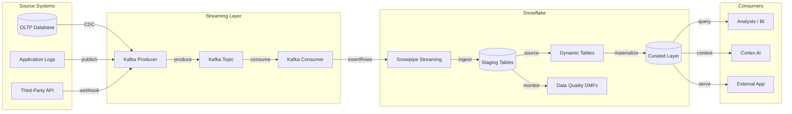
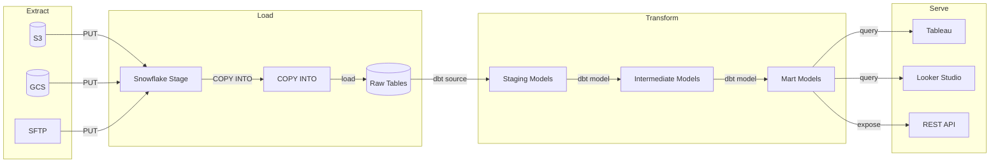

# Template: Data Pipeline (ETL/ELT)

A left-to-right flowchart showing a data pipeline from source to consumption. Suitable for ETL, ELT, streaming, and batch pipelines.

## When to use

Use this template when the user describes a data pipeline, an ingestion flow, an ETL process, a streaming architecture, or a batch transformation workflow.

## Template: Kafka Streaming Pipeline

## Template: Batch ELT Pipeline

## Key customization points

- Add a `DataQuality` node with dashed edges for monitoring steps
- Add a `Failed Records` branch from Staging for dead-letter handling
- Collapse source systems into one node (`SourceSystems`) for a simpler overview diagram
- Add a task scheduler (`AirflowDAG` or `SnowflakeTasks`) connected to the transform layer
