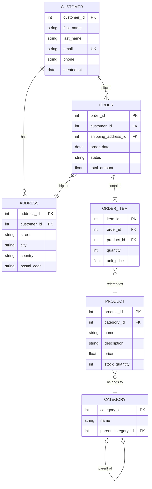
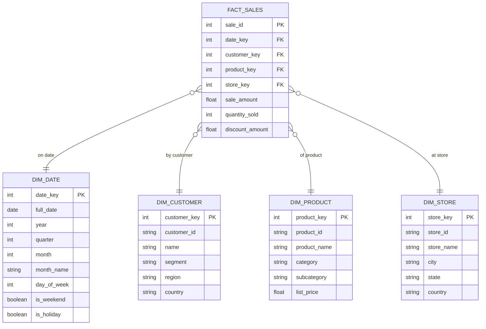

# Template: ER Schema

Database entity-relationship diagrams for common data domain patterns.

## When to use

Use this template when the user describes a database schema, asks for an ER diagram, describes entities with foreign key relationships, or wants to visualize a data model.

## Template: E-Commerce Schema

## Template: Star Schema (Data Warehouse)

## Key customization points

- Add a `FACT_RETURNS` table linking back to `FACT_SALES` via `sale_id FK`
- Add a `DIM_PROMOTION` for discount/campaign tracking
- Add `SCD_TYPE2` fields to dimension tables: `effective_date`, `expiry_date`, `is_current`
- Add a bridge table for many-to-many relationships (e.g., products with multiple categories)
