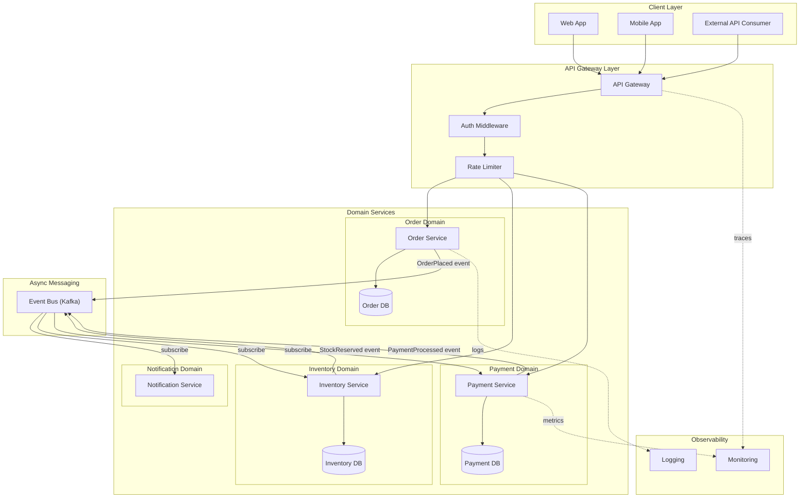
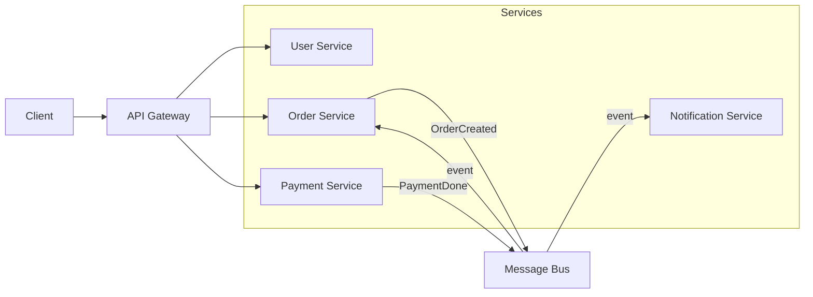

# Template: Microservices Architecture

A flowchart showing a microservices architecture with an API gateway, service mesh, async messaging, and data stores.

## When to use

Use this template when the user describes a microservices system, a service mesh, bounded contexts, an event-driven architecture, or services communicating via a message bus.

## Template: Domain-Driven Microservices

## Simplified variant: core services only

## Key customization points

- Replace `Kafka` with `RabbitMQ`, `SNS/SQS`, or `Snowflake Dynamic Tables` for the event bus
- Add a `Service Registry` (e.g., Consul) connected to the Gateway for service discovery
- Add a `Circuit Breaker` between the Gateway and downstream services
- Add `Read Replicas` beside each database for query scaling
- Show async vs sync paths: solid arrows for synchronous, dashed `-.->` for async/events
